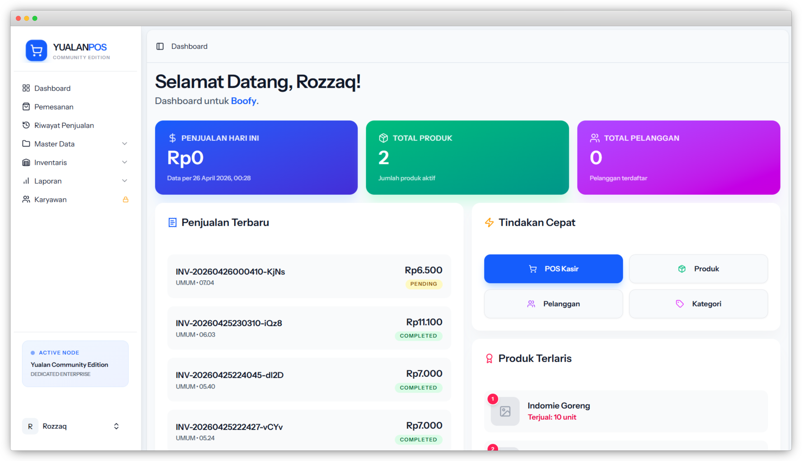
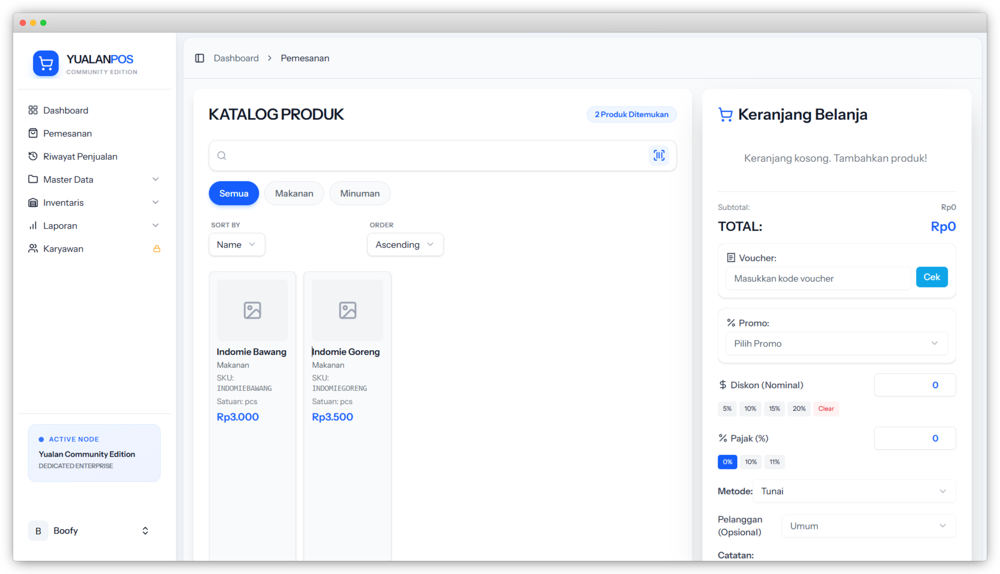

# 🚀 Yualan Community Edition (Dedicated Enterprise)

**Solusi Point of Sale (POS) Mandiri untuk Instansi Tunggal yang Mengutamakan Kendali Penuh atas Data dan Infrastruktur.**

---

## 👋 Tentang Yualan Community Edition

**Yualan Community Edition (Dedicated Enterprise)** adalah platform POS *self-hosted* yang dirancang khusus bagi pemilik bisnis dan organisasi yang membutuhkan otoritas mutlak atas basis data mereka. 

Sistem ini ideal bagi instansi yang:
- Menginginkan kedaulatan data penuh tanpa ketergantungan pada pihak ketiga.
- Memerlukan akses database langsung untuk integrasi sistem internal.
- Memiliki tim IT mandiri yang mampu mengelola infrastruktur server pribadi.
- Membutuhkan performa tinggi melalui alokasi sumber daya server yang berdedikasi.

### 🖼️ Preview Antarmuka

*Tampilan Dashboard Analytics*


*Antarmuka Point of Sale (POS)*

---

## ✨ Fitur Utama

### 🛒 Operasional Kasir & Penjualan
- **Transaksi Cepat & Responsif** - Dioptimalkan untuk alur kerja yang padat.
- **Manajemen Produk Enterprise** - Dukungan SKU, kategori kompleks, dan manajemen unit barang.
- **Voucher & Promosi** - Sistem manajemen promo mandiri untuk meningkatkan loyalitas pelanggan.
- **Customer CRM** - Kelola database pelanggan Anda sendiri secara privat.

### 📦 Inventaris & Rantai Pasokan
- **Stock Card Real-Time** - Pantau histori pergerakan barang dengan detail.
- **Adjustment & Receiving** - Modul penerimaan barang dan penyesuaian stok yang akurat.
- **Supplier Directory** - Kelola data pemasok barang untuk mempermudah operasional.

### 📊 Pelaporan & Transparansi
- **Laporan Detail Penjualan** - Akses data mentah transaksi untuk keperluan audit dan analisis.
- **Pembayaran & Piutang** - Pantau arus kas masuk dan manajemen piutang pelanggan.

---

## 🏗️ Teknologi Inti
- **Backend**: Laravel 12 (PHP 8.3+)
- **Frontend**: Vue 3 + Inertia.js (Modern SPA)
- **Database**: SQLite (Default for easy setup) / PostgreSQL (Supported for Enterprise Stability)
- **Styling**: Tailwind CSS & Vanilla CSS

---

## 🛠️ Instalasi Server Mandiri

Pastikan server Anda sudah terpasang PHP 8.3+ dan Node.js 20+. Jika menggunakan PostgreSQL, pastikan PostgreSQL 15+ juga terpasang.

### Cara 1: Menggunakan Composer (Direkomendasikan)
Gunakan perintah ini untuk mengunduh dan menyiapkan proyek secara otomatis:

```bash
# 1. Buat proyek baru
composer create-project abdurozzaq/yualan --stability alpha
cd yualan

# 2. Bangun Aset Frontend
npm install
npm run build
```

### Cara 2: Menggunakan Docker (Paling Cepat)
Sangat direkomendasikan jika Anda tidak ingin menginstal PHP atau Node.js secara manual di server.

```bash
# 1. Jalankan aplikasi dengan Docker Compose
docker-compose up -d
```
Aplikasi akan langsung tersedia di `http://localhost:8627`.

### Cara 3: Manual (Git Clone)
Jika Anda ingin melakukan instalasi secara manual tanpa Docker:

```bash
# 1. Clone repository
git clone https://github.com/Abdurozzaq/Yualan.git
cd Yualan

# 2. Instalasi Dependensi
composer install --optimize-autoloader --no-dev
npm install

# 3. Konfigurasi Environment
cp .env.example .env
# Sesuaikan koneksi database Anda di .env (Default: SQLite)

# 4. Inisialisasi Database
php artisan key:generate
php artisan migrate --seed --force

# 5. Build Aset Frontend
npm run build
```

---

## ⚡ Malas Setup Server?

Bagi instansi yang ingin menggunakan fitur lengkap Yualan tanpa perlu repot mengelola server sendiri, kami menyediakan **Yualan Premium**.

- **Terima Beres** - Hosting, SSL, dan Maintenance ditangani oleh kami.
- **Fitur Lanjutan** - Termasuk Laba Bersih, Analisis Produk Terlaris, Manajemen Karyawan, dan update rutin.
- **Dukungan Prioritas** - Bantuan teknis langsung dari tim Nusavasoft.

🌐 **Cek Edisi Premium:** [yualan.web.id](https://yualan.web.id)

---

## ⚖️ Lisensi

Proyek ini dilisensikan di bawah **GNU GPL v2**. Pengguna memiliki kebebasan penuh untuk memodifikasi dan menjalankan sistem ini di infrastruktur masing-masing dengan tetap mematuhi aturan distribusi kode sumber asli.

---

**Created Under PT. Nusavasoft Digital Solutions**
